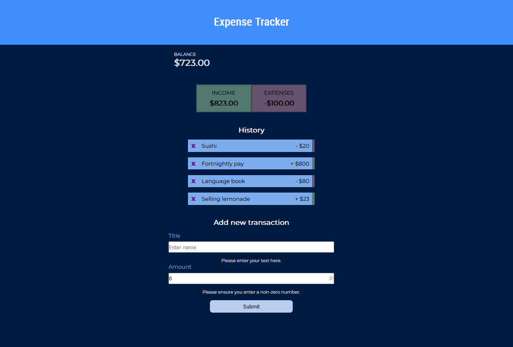

# Expense Tracker (COMPLETE)

A simple expense tracker created using React.
Stack: HTML, SCSS, React

Loosely based on this tutorial by Traversy Media (https://www.youtube.com/watch?v=XuFDcZABiDQ).

This project is complete bar the Light Mode extension task - functionality of adding items, removing items and updating the values are all added, alongside user feedback, validation and responsiveness down to 360px wide.

## MVP

-   Have a balance, an income and an expenses component
-   List all transactions
-   Allow adding new transactions
-   Allow deletion or editing of transactions in case of a misinput/mistype
-   Update balance, income and expenses and transaction list when new items are added/if items are deleted

## Extensions

-   Validation - ensuring the user cannot submit empty text, 0 dollar values, or NaN values (complete)
-   Providing feedback to user about validation: when fields have invalid values, show a text component that tells them what they need to enter. (complete)
-   Dark Mode/Light Mode (not yet implemented)

# Styling and Graphic Design

## Colour Palettes

-   Dark mode with a range of blues, dark blue-greys and white elements. Inspired by a stylised image of a whale shark. Also features some more dull greens and purples for the expenses/income element, to help it stand out without being too in-your-face.
-   Light mode with bright yellows, oranges and browns. Inspired by a stylised image of a giraffe. (NOT YET IMPLEMENTED)

## Responsiveness

This app is currently responsive down to approximately a 360px screen. This makes it accessible on screen sizes down to the approximate width of the Galaxy S20, and narrower than the iPhone 11 and the Galaxy Note 20.)

I would usually go with the Bootstrap grid system, however the minimum there is only 576px, so I opted for a more customised option for approx 360-450px (depending on how it looks best for each screen size.)

This also modifies the elements and the font sizes for the cleanest looking form possible.

On the iPhone 12 (390px x 844px) you can add three transactions while viewing the entire screen without scrolling (as seen in the image). However, on the Galaxy S10 (360px x 760px) you can only view one transaction. This is unfortunate but I found making the elements any smaller made the page seem crowded.

# How to Install

If you'd like to test this project out, great! Feel free to:

1. Download the files from GitHub.
2. Navigate into the folder.
3. Install the required node modules (they are being ignored) by typing npm i into the console. This will install all required modules. You need the npm installer for this.
4. Once all the modules are installed, type npm start or npm run start into the console.
5. Voila! The finished project.
